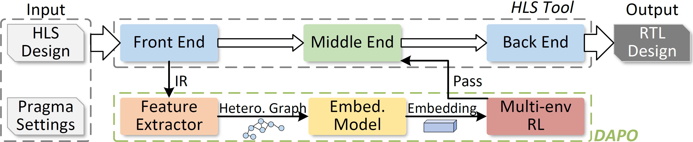

# DAPO: Design Structure Aware Pass Ordering in High-Level Synthesis with Graph Contrastive and Reinforcement Learning

DAPO has been accepted to DATE'26. The pre-print is available on arXiv: <https://arxiv.org/abs/2512.11342>.

DAPO provides an end-to-end toolchain that learns design-aware optimization pass schedules for high-level synthesis. The workflow couples (i) heterogeneous graph contrastive learning for program embeddings, (ii) reinforcement learning for pass sequencing, and (iii) an LLVM-based quality-of-result (QoR) estimator used for fast reward evaluation.



## 1. Prerequisites
- LLVM/Clang 18.1.x installed and discoverable on `PATH`
- CMake ≥ 3.20 and a C++20-capable compiler
- Python ≥ 3.9
- Recommended: GPU with CUDA support for faster model training

If you are new to LLVM toolchain setup, refer to our tutorial: <https://github.com/gjskywalker/LLVM-18-Tutorials>.

Install Python dependencies from the repository root:

```shell
pip install -r requirements.txt
```

## 2. Build Analysis Tools
DAPO uses two custom LLVM passes: a feature extractor and a QoR (cycle) estimator. Build and stage both executables via the provided script:

```shell
cd /path/to/DAPO
./build_analysis.sh
```

The script configures `Analysis/` with CMake, builds the passes, and copies the resulting binaries to `Analysis_tools/feature_exctractor/feature_exctractor` and `Analysis_tools/qor_estimator/qor_estimator`. These locations are consumed directly by the Python utilities.

## 3. Datasets & Intermediate Artifacts

### 3.1 Benchmark Sources
Benchmark C files are organized under `Dataset/`:
- `Dataset/trainingset/`: randomized kernels used by RL training.
- `Dataset/Cross_Validation/`: folds for GNN/RL model evaluation.
- `Dataset/HLSDesigns/`: representative real-world HLS programs.

### 3.2 Generate LLVM IR
Convert source benchmarks into LLVM IR (placed in `Raw_IRs/`) before graph construction:

```shell
python generate_ir.py \
	--Source Dataset/trainingset \
	--Output Raw_IRs
```

Repeat for other benchmark folders as needed.

## 4. Dataset Generation & GNN Models
All GNN-related scripts live under `Models/GNNModels/`.

### 4.1 Generate Graph Datasets

```shell
cd Models/GNNModels

# Convert LLVM IR files into heterogeneous graphs
python Build_Dataset.py \
	-d ../../Raw_IRs \
	-o Raw_Graphs \
	-t NGraph

# Optional: compute HGED distances for cross-program analysis
python HGED_Calculate.py
```

### 4.2 Train and Evaluate GNNs

```shell
# Train all configured GNN variants (GCN, RGCN, PNA, etc.)
python Train_All_Models.py \
    --epochs 200 \
    --patience 3

# Run inference 
python Infer_Pytorch.py 
```

Key outputs are placed under `Models/GNNModels/models/` and `Models/GNNModels/HGED_Result_Dapo/`.

## 5. Reinforcement Learning Environment
RL scripts are located in `Models/RLModels/`. The environment consumes the feature extractor and QoR estimator staged earlier, so no manual path editing is required.

### 5.1 Prepare Training Assets
- Ensure `Dataset/trainingset/` contains the C benchmarks (e.g., `random*.cc`).
- Place trained GNN checkpoints in `Models/GNNModels/models/` (or update paths when launching RL).

### 5.2 Launch RL Training & Inference

```shell
cd ../RLModels

# PPO training with a single environment
python ppo_ray.py \
	--feature-type rgcn \
	--run-name rgcn_single \
	--model-path Embedding_model_RGCNConv.pth

# PPO training with multiple parallel environments
python ppo_ray_multienv.py \
	--feature-type rgcn \
	--run-name rgcn_multi \
	--model-path Embedding_model_RGCNConv.pth
```

Command-line arguments mirror the options defined in each script (see the `--help` flag for full listings). Generated feature traces and cycle logs are stored under `Models/RLModels/gym_env/envs/Feature_Cycles_Tests/`.

## 6. Repository Layout

```
Analysis/                 # C++ sources for feature extractor and QoR estimator
Analysis_tools/           # Staged LLVM tool binaries (created by build_analysis.sh)
Dataset/                  # Training and evaluation C benchmarks
Models/
	├── GNNModels/          # Graph dataset pipeline and GNN training scripts
	└── RLModels/           # Reinforcement learning environments and PPO drivers
Raw_IRs/                  # Sample LLVM IR inputs for dataset generation
```

## 7. Troubleshooting
- `qor_estimator not found`: rerun `./build_analysis.sh` and verify LLVM 18 is on your `PATH`.
- `clang failed to generate bitcode`: confirm your LLVM clang binary is version 18 and accessible.
- RL training stalls: ensure the feature extractor outputs CSV files in `Feature_Cycles_Tests/`; delete stale contents if rerunning.

For questions or reproducibility details, please open an issue or contact the authors listed in the paper.
